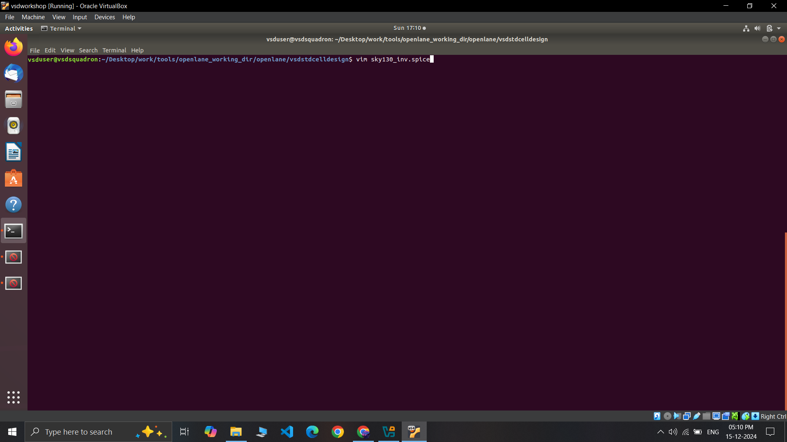
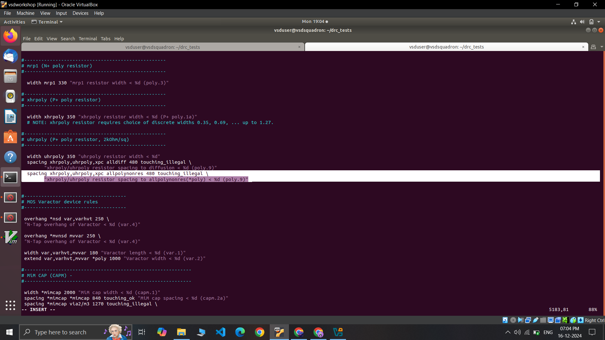
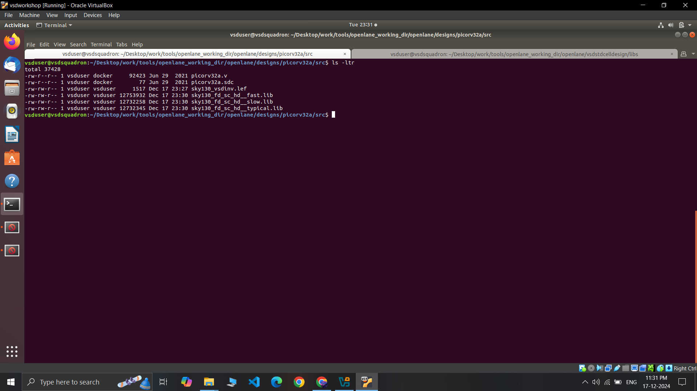
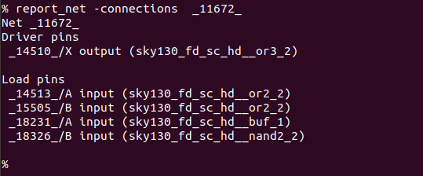
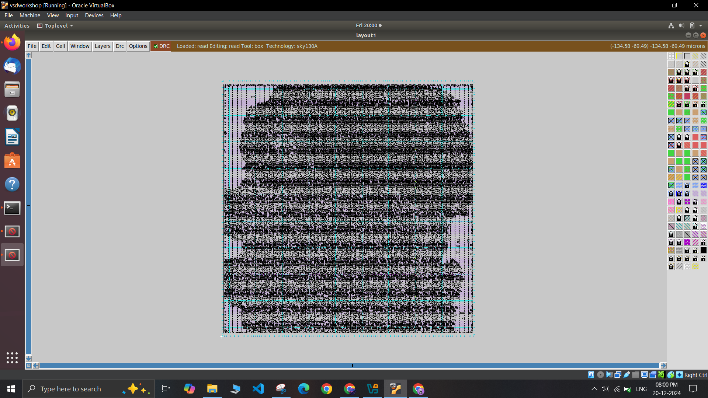

# SoC Design and Planning

## Day 1: Inception of open-source EDA, OpenLANE and Sky130 PDK

<details>
  <summary><strong>Day 1 Theory</strong></summary>

### Introduction
This project demonstrates the process of designing an ASIC using the **OpenLane** flow, focusing on the synthesis of the **PicoRV32A** design and the calculation of the **Flop Ratio**. The flow follows the **RTL-to-GDSII** process, utilizing open-source tools and libraries to complete the design and verification.

---

### QFN-48 Package

A **QFN-48 (Quad Flat No-Lead)** package is a surface-mount integrated circuit package with 48 leads or pads. It is compact and thermally efficient, ideal for high-performance applications requiring a small form factor.

---

### Package, Pads, Die, Core, and Chip

- **Package**: The physical housing of an integrated circuit, protecting the chip and providing connectivity to external circuits.
- **Pads**: Metal terminals on the die's edges used for electrical connections to the package or external circuit.
- **Die**: The silicon wafer piece containing the integrated circuit (IC).
- **Core**: The central functional part of the die, such as the CPU or processing unit.
- **Chip**: The complete semiconductor device, including the die and the package.

### Relation:
The **package** houses the **die**, which contains the **core**. The **pads** on the edges of the die enable electrical connections between the die and the package or external circuit.

---

### Foundry IPs and Macros

**Foundry IPs** are pre-designed blocks provided by semiconductor foundries:
- **PLL**: Phase-Locked Loop for clock generation and synchronization.
- **ADC**: Analog-to-Digital Converter for signal conversion.
- **SRAM**: Static Random-Access Memory for fast, volatile storage.
- **DAC**: Digital-to-Analog Converter for signal conversion.

**Macros** are high-level, pre-designed components used in chip design:
- **RISC-V SoC**: A system-on-chip based on the RISC-V instruction set architecture.
- **SPT**: Single Processing Thread, referring to specialized processing architectures.

---

### RISC-V ISA

**RISC-V** is an open-standard Instruction Set Architecture (ISA) based on the principles of reduced instruction set computing. It’s designed to be simple, extensible, and open, providing an excellent foundation for building custom processors and microcontrollers.

---

### ASIC Design Flow: RTL to GDSII


1. **Synthesis**:  
   - Converts RTL (written in HDL) into a circuit using components from the standard cell library.  
   - **Standard Cells**:  
     - Have a regular layout.  
     - Each cell comes with different models/views:  
       - **Functional Model**: Describes cell behavior.  
       - **Timing Model**: Captures timing constraints and delays.  
       - **Power Model**: Details power consumption.  
       - **Physical Layout**: Describes the geometrical arrangement for placement and routing.

2. **Floor/Power Planning**:  
   - **Chip Floor Planning**: Divides the chip die among different system building blocks.  
   - **Macro Floor Planning**: Specifies dimensions, pin locations, row definitions, and routing tracks.  
   - **Power Planning**: Constructs a power network to deliver power effectively across the design.

3. **Placement**:  
   - Places standard cells on the floor plan rows aligned with wiring.  
   - Includes:  
     - **Global Placement**: Finds optimal positions for all cells, allowing overlaps and potential illegal placements.  
     - **Detailed Placement**: Adjusts the global placement minimally to ensure legality (e.g., no overlaps).  

4. **Clock Tree Synthesis (CTS)**:  
   - Distributes the clock signal to all sequential elements with minimal skew and in a balanced shape.  
   - Common structures include **H-tree** and **X-tree** architectures.

5. **Routing**:  
   - Implements interconnects using available metal layers to connect cells.  
   - **SkyWater 130nm PDK Example**:  
     - Defines 6 routing layers, the lowest is made of **titanium**, and the rest are **aluminum**.  
     - Metal tracks form a large routing grid; the **divide-and-conquer** approach is used to manage complexity.

6. **Sign-Off**:  
   - Ensures the design is fabrication-ready and meets specifications.  
   - Includes:  
     - **Physical Verification**: Checks physical integrity and correctness.  
     - **DRC (Design Rule Checks)**: Verifies compliance with process design rules.  
     - **LVS (Layout vs. Schematic Check)**: Ensures the physical layout matches the schematic.  
     - **Static Timing Verification**: Confirms timing constraints are met.


### ASIC Design Flow: RTL to GDSII


</details>


<details>
  <summary><strong>Day 1 Labs</strong></summary>

## Tasks:
1. Perform synthesis for the **PicoRV32A** design.  
2. From the synthesis output, calculate the **Flop Ratio**, which is defined as:  

    Flop Ratio = `(Number of D Flip-Flops) / (Total Number of Cells)`


---

### Lab Process Steps

1. **Initial State of Terminal**  

   In this image, we see the initial state of the terminal where we will access the **OpenLane** directory and begin the process.

2. **Entering the OpenLane Directory** 
 
   Here, we have navigated to the **OpenLane** directory, where we will start working with the design flow.

3. **Invoking OpenLane Flow with Docker**  

   At this step, we invoke the **OpenLane** flow using the **Docker** command to set up the required environment for synthesis.

4. **Dealing with the `flow.tcl` File in Interactive Mode**  

   Inside the OpenLane flow, we work with the **flow.tcl** file to process the design in **interactive mode**. Here, we also bring in the necessary packages to ensure proper functionality.

5. **Preparing the Initial Design from PicoRV32A Directory**  

   In this image, we prep the initial design by navigating to the **PicoRV32A** design directory, where we will work on synthesis.

6. **Preparation Complete, Running `run_synthesis` Command** 
 
   Here, the preparation is complete, and we run the **`run_synthesis`** command to initiate the synthesis step.

7. **Synthesis Complete, Analyzing Results**  
 
   The synthesis step has completed, and we are now ready to examine the results, including calculating the **flop ratio**.

8. **Total Number of Cells** 
  
   The total number of cells in the design is **14,876**.

9. **Total Number of D Flip-Flops**  
 
   The total number of D Flip-Flops in the design is **1,613**.

10. **Viewing Flop Ratio Statistics**  
 
 
 

11.  **Flop Ratio Calculation**  
    Now, we calculate the **flop ratio** using the formula:  
    ```
    Flop Ratio = (Number of D Flip-Flops) / (Total Number of Cells)  
    ```
    
    Substituting the values:  Flop Ratio = 1613 / 14876 ≈ 0.10842

    Percentage of D Flip-Flops = 0.1088 × 100 = 10.842%

</details>

---

## Day 2: Good floorplan vs bad floorplan and introduction to library cells

<details>
  <summary><strong>Day 2 Theory</strong></summary>

### Floorplanning

**Floorplanning** is the step in the physical design process where the layout of the chip is determined, including the dimensions, placement of macros, standard cells, and power planning. It sets the foundation for efficient placement and routing.

#### Steps of Floorplanning

1. **Define Width and Height of Core and Die:**
   - Establish the dimensions of the core and die to accommodate all components.

2. **Define Locations of Pre-Placed Cells:**
   - Place large macros and cells that are fixed due to design constraints.

3. **Use of Decoupling Capacitors:**
   - Place decap cells to manage voltage fluctuations.

4. **Power Planning:**
   - Create a grid of **VDD** and **VSS** lines to ensure proper power delivery.

5. **Pin Placement:**
   - Position input/output pins for efficient routing.

6. **Logical Cell Placement Blockage:**
   - Define areas where standard cells should not be placed to avoid congestion.

---

### Placement and Routing

**Placement** involves assigning precise physical locations to standard cells within the core area, while **routing** connects these cells using metal layers. The placement process ensures optimal performance and minimal congestion.

#### Steps of Placement and Routing

1. **Bind Netlist with Physical Cells:**
   - Map logical design components to physical cells in the library.

2. **Placement:**
   - Perform global and detailed placement to ensure optimal positions.

3. **Optimized Placement:**
   - Refine cell locations to enhance performance and reduce routing complexity.

---

### Standard Cells, Cell Design Flow, and Need for Characterization

During each step of physical design, standard cells like gates, buffers, inverters, and flip-flops are commonly used. A collection of these cells forms the **library**, which is essential for EDA tools to interpret and implement the design. Libraries include cells of varying sizes, functionalities, and threshold voltages.

#### Cell Design Flow

Each standard cell is created using a defined process:

1. **Input:**
   - **PDKs:** Process Design Kits containing DRC and LVS rules, SPICE models.
   - **Library Specifications:** User-defined constraints and functionality.

2. **Design Steps:**
   - **Circuit Design:** Define the electrical behavior.
   - **Layout Design:** Create the physical representation.
   - **Characterization:** Evaluate timing, noise, and power.

3. **Output:**
   - **Circuit Description Language (CDL):** Output of circuit design.
   - **GDSII, LEF, Extracted SPICE Netlist:** Outputs of layout design.
   - **Timing, Noise, Power .LIBs:** Outputs of characterization.

#### Characterization Flow

Characterization evaluates the performance of cells in terms of **timing**, **power**, and **noise**. This step often uses tools like **GUNA** to generate accurate metrics for library cells.

</details>


<details>
  <summary><strong>Day 2 Labs</strong></summary>

## Tasks:

1. Running the floorplanning step for **PicoRV32A**, followed by accessing the die size, calculating its area, and using the Magic tool to view and explore the floorplan.  

2. Running the placement step for **PicoRV32A**, followed by using the Magic tool to view and explore the placement.  
---

### Lab Process Steps

### Task 1:
1. **Run the `run_floorplan` Command**
   - This step is performed after running the `run_synthesis` command (refer to Day 1 Lab).

   
   
   

2. **Access the `picorv32a.floorplan.def` File**
   - Navigate to the relevant directory as shown below.

   

3. **Calculate Die Area**
    
   - Inside the `.def` file, note the die dimensions:
     - **Die Width = 660685 units**
     - **Die Height = 671405 units**

   - Using the formula:
     
     ```
     Die Area (in unit square) = Die Width * Die Height
     ```
     
     Convert to microns:
    ```  
    Die Area (in microns square) = Die Area (in unit square)/10^6
    ```  

   - Die Area = `443587.21 micron²`

4. **Use Magic Tool for Floorplan Visualization**
   - Command to open Magic for graphical exploration.

   

5. **Floorplan Results**
   - **Floorplan DEF in Magic:**
     
   - **Port Layers:**
     
     
   - **Equidistant Ports:**
     
   - **Decap Cells and Tap Cells:**
     
   - **Unplaced Standard Cells:**
     

 ### Task 2:

1. **Run the `run_placement` Command**
   - Command to perform placement step.

   
   
   

2. **Use Magic Tool for Placement Visualization**
   - Open Magic to view placement results graphically.

   

3. **Placement Results**
   - **Placement Results in Magic:**
     
     

</details>

---

## Day 3: Design Library Cells Using Magic Layout and NGSpice Characterization

<details>
  <summary><strong>Day 3 Theory</strong></summary>

### Standard CMOS Inverter

In this section, we learn about the **standard CMOS inverter** and its SPICE deck to acquire its **Vout vs Vin** characteristics. The basic CMOS inverter consists of a PMOS transistor connected to a VDD supply and an NMOS transistor connected to VSS. The input signal is applied to the gate of both transistors, and the output is taken from the connection between the PMOS and NMOS. The key characteristics of a CMOS inverter are its low power consumption, high noise margins, and ability to drive large currents.  

When analyzing the inverter in SPICE, we can observe its output voltage (Vout) as a function of the input voltage (Vin). The transition from low to high output voltage corresponds to the switching behavior of the inverter.

**Practical Implementation:**  
For our implementation, we select the **W/L ratio of the PMOS transistor** to be slightly greater than that of the NMOS transistor. This ensures proper voltage levels at the output.

### Static and Dynamic Characterization of CMOS

- **Static Characterization:**  
  Key parameters such as **input high voltage (Vih)**, **input low voltage (Vil)**, **output high voltage (Voh)**, **output low voltage (Vol)**, **switching threshold voltage (Vth)**, and **noise margins** help in static characterization.

- **Dynamic Characterization:**  
  Parameters such as **propagation delay**, **rise time**, and **fall time** are used to evaluate dynamic behavior.

### 16-Mask CMOS Fabrication Process

The steps in the **16-mask CMOS fabrication process** are as follows:

1. **Selecting a substrate:** We select a **p-Si** substrate.
2. **Creating active regions for transistors.**
3. **Formation of N-well and P-well.**
4. **Formation of the gate.**
5. **Formation of lightly doped drain (LDD):** This helps avoid hot electron effects and short channel effects.
6. **Source and drain formation.**
7. **Formation of contacts and local interconnects.**
8. **Higher-level metal formation.**  
   

### Use of LEF Files in VLSI Industry

**LEF (Library Exchange Format)** files are widely used in the VLSI industry to describe the physical layout of standard cells, including their geometries, pin locations, and other properties. LEF files provide a crucial interface between the design and manufacturing processes.

</details>


<details>
  <summary><strong>Day 3 Labs</strong></summary>

## Tasks:

1. Clone the standard inverter cell from the given repository and explore it in Magic.  
2. Perform SPICE extraction of this inverter.  
3. Modify the SPICE deck of the inverter and analyze it through post-layout simulations.  
4. Learn about DRC rules, fix errors in the Magic DRC tech file, and validate the updated designs.

--- 

### Lab Process Steps

## Task 1:

1. Clone the git repository from the provided URL:
   ```bash
   git clone https://github.com/nickson-jose/vsdstdcelldesign

  

2. Copy `sky130A.tech` file:
   from ~/Desktop/work/tools/openlane_working_dir/pdks/sky130A/libs.tech/magic/ to
~/Desktop/work/tools/openlane_working_dir/openlane/vsdstdcelldesign/

  

3. Open the inverter design in Magic using the following command:  
magic -T sky130A.tech inverter.mag &
  

4. Explore the inverter design as follows:  
- Upper region is PMOS.  
- Lower region is NMOS.  
- Y is the output.  
- A is the input.  
- VSS connectivity is with VGND.  
- VDD connectivity is with VPWR.  

  
  
  
  
  
  

---

## Task 2: 

1. Extract the inverter cell in Magic.  
  
  

2. Check if the `.spice` file is created at the required location.  
  

---

## Task 3:  

1. Open the `.spice` file, explore it, change the model parameters and values as shown in the last image. Also note that the minimum cell dimension is `0.010u` so change it also      

  
resultant final spice deck(.spice) file is :


2. Run NGSpice simulation and plot y (output) vs time along with input a.


4. Calculate the following values:  

- **Rise Transition Time**:  
  ```
  Rise Transition Time = Time taken by output to reach 80% of its peak value - Time taken by output to reach 20% of its peak value
  ```  
  20% = `0.66 V`, 80% = `2.64 V`

  20 %
  
  80 %
  

  coordinates
  

  Rise Transition Time = `(2.246 - 2.182) ns = 0.064 ns`  

- **Fall Transition Time**:  
  ```
  Fall Transition Time = Time taken by output to fall to 20% of its peak value - Time taken by output to fall to 80% of its peak value
  ```  
  80 %
  
  20 %
  

  coordinates
  
  Fall Transition Time = `(4.095 - 4.052) ns = 0.043 ns`  

- **Rise Cell Delay**:  
  ```
  Rise Cell Delay = Time taken by output to reach 50% of its peak value - Time taken by input to fall to 50% of its peak value
  ```  
  50% = `1.65 V`  
  
  
  Rise Cell Delay = `(2.211 - 2.150) ns = 0.061 ns`  

- **Fall Cell Delay**:  
  ```
  Fall Cell Delay = Time taken by output to fall to 50% of its peak value - Time taken by input to reach 50% of its peak value
  ```  
  
   
  Fall Cell Delay = `(4.077 - 4.049) ns = 0.028 ns`  

---

## Task 4:  

1. Download the lab files, change the directory, and open the Magic tool for graphical exploration.

 

Open the `.magicrc` file in vim.


Empty Magic layout along with terminal:
 

2. Go to: [SkyWater PDK Rules](https://www.skywater-pdk.readthedocs.io/en/main/rules/periphery.html#poly).  


3. Open `poly.mag` in Magic to check for violations under the `poly.9` DRC rule.  

 

4. Identify the incorrectly implemented designs violating `poly.9` (dimension `< 0.480 um`).
poly.9 drc rule

violated rule in magic which is not considered as drc violation
  

5. Add a new rule for `poly.9` in the `sky130A.tech` file.  



6. Reload the tech file and perform DRC check to validate the fixes.  

7. We can also implement other design to verify poly.9 drc check


### **Fixing the nwell.4 DRC Rule Implementation**  

1. `nwell.4` states:  
 

2. Identify missing violations in Magic.  
 

3. Add a new rule for `nwell.4` in the `sky130A.tech` file.  

 

4. Reload the tech file and rerun DRC checks.  
  

### **Fixing the difftap.2 DRC Rule Implementation**  

1. `difftap.2` states:  


2. Identify missing violations in Magic.  


3. Add a new rule for `difftap.2` in the `sky130A.tech` file.  
  

4. Reload the tech file and rerun DRC checks.  
 

</details>

---

## Day 4: Pre-layout timing analysis and importance of good clock tree

<details>
  <summary><strong>Day 4 Theory</strong></summary>
  
## Custom Design Layout Verification
Before progressing in the flow with the custom design layout, we verify the following conditions:

1. **Pin Alignment:** Input and output pins must lie at the intersection of vertical and horizontal tracks.
2. **Standard Cell Width:** The width of the standard cell should be an odd multiple of the horizontal track pitch.
3. **Standard Cell Height:** The height of the standard cell should be an even multiple of the vertical track pitch.


## Delay Tables in Power-Aware Clock Tree Synthesis
Delay tables are crucial for power-aware clock tree synthesis.

### 1. Clock Gating
- **AND Gate Clock Gating:** Produces a clock-like output when `Enable` is high, using an AND gate with `Clock` and `Enable` as inputs.
- **OR Gate Clock Gating:** Produces a clock-like output when `Enable` is low, using an OR gate with `Clock` and `Enable` as inputs.
- **Purpose:** Prevents short-circuit and switching power losses.

### 2. Delay Table
- Represents the relationship between output loads and input slew for each clock buffer.
- The size of a buffer, determined by the W/L ratio of PMOS and NMOS transistors, defines its delay table category.
- **Application:** Guides clock buffer selection and placement.


## Setup Timing Analysis (Ideal Single Clock)
- **Setup Timing Condition:**
  \[
  Θ < T - S
  \]
  where:
  - \( Θ  \): Combinational delay between launch and capture flops.
  - \( T \): Clock time for the capture flop after the launch flop.
  - \( S \): Setup time (flip-flop input \( D \) propagation time to output QM).

- **Clock Jitter:** Temporary variations in clock period due to internal circuitry can cause deviations in clock edges.
  - **Setup Uncertainty (SU):** To account for jitter, the condition becomes:
    \[
    Θ  < T - S - SU
    \]


## Clock Tree Routing and Buffering

1. **H-Tree Algorithm:** Ensures the clock signal is optimally routed to minimize skew and efficiently connect the clock to flip-flops.

2. **Clock Buffers:** Reduce RC distortions in the clock network caused by routing wires.

3. **Clock Net Shielding:** Protects critical clock nets from crosstalk-induced glitches or delays by:
   - Placing wires connected to \( VDD \) or \( GND \) between signal routes to break coupling capacitance.
   - Applying shielding only to critical nets, such as clock nets.


## Setup Timing Analysis (Real Clock)
- With buffers in the clock path, the setup condition becomes:
  \[
  Θ  + Δ1 < T + Δ2 - S - SU
  \]
  where:
  - \( Δ1 \): Launch flop delay.
  - \( Δ2 \): Capture flop delay.
  - \( |Δ1 - Δ2| \): Clock slew.

- **Slack Calculation:**
  \[
  Slack = Data Required Time - Data Arrival Time
  \]
  - Slack must be zero or positive.


## Hold Timing Analysis (Real Clock)
- **Hold Timing Condition:**
  - For the same clock edge sent to both launch and capture flops:
    \[
    Θ  > H
    \]
    where \( H \) is the hold time (determined by the second internal MUX delay of the flip-flop).

- With real clocks, the condition becomes:
  \[
  Θ  + Δ1 > H + Δ2 + HU
  \]
  where:
  - \( HU \): Hold uncertainty.

- **Slack Calculation:**
  \[
  Slack = Data Arrival Time - Data Required Time
  \]
</details>


<details>
  <summary><strong>Day 4 Labs</strong></summary>

 ## Tasks:

1. Verify the guidelines for the custom design to be inserted in the flow, save the finalized layout with a custom name, open it, and generate LEF from the Magic layout.
2. Copy the new LEF and required library files to the `picorv32a` design's `src` directory and edit the `config.tcl` file to change the library file and add the new LEF file to the flow.
3. Run the synthesis with the new custom inverter cell inserted into the OpenLane flow.
4. Reduce the violations caused by the new custom inverter cell by changing some synthesis parameters.
5. Run the floorplan and placement and verify if our custom cell is accepted in the PnR flow.
6. Perform post-synthesis timing analysis using the OpenSTA tool, and make timing ECO fixes to remove all violations and reduce slack.
7. Replace the old netlist with the new one, and then run floorplan, placement, and CTS.
8. Perform post-CTS OpenROAD timing analysis, and further repeat it by removing `sky130_fd_sc_hd__clkbuf_1` cell from the clock buffer list variable `CTS_CLK_BUFFER_LIST`.

--- 

### Lab Process Steps

### Task 1: 

1. Open `tracks.info` of `sky130_fd_sc_hd` and check it.  
     
     

2. Open the custom cell in Magic to verify the guidelines.  
   - First, set grid as tracks of local layer.  
     .PNG)  

   - Verifying the three guidelines:  
     
       
     - (1.38um is odd multiple of .46um)  
       
     - (2.72um is even multiple of .34um)  

3. Save the layout with a custom name.  
     

4. Open the layout.  
    
   

5. Generate the LEF file and verify its location.  
    
   
   -screenshot of the LEF file.
   

### Task 2:

1. Copy the new LEF and required library files to the `picorv32a` design's `src` directory and verify their location.  
     
     
     

2. Open the `config.tcl` file and edit it as shown to include the new LEF.  
     
     

### Task 3:

1. Run the synthesis with the new custom inverter cell inserted in the flow.  
   - The process will remain the same as running synthesis in previous cases, but we will add two additional commands to include the newly added LEF into the OpenLane flow:  
   ```tcl
   set lefs [glob $::env(DESIGN_DIR)/src/*.lef]
   add_lefs -src $lefs
   ```
  
  
  
  
  

### Task 4:

1. First, read the `README.md` file to understand the variables that affect the synthesis, which we can use to reduce violations.  
   

2. Check the chip area and TNS (Total Negative Slack), WNS (Worst Negative Slack) for the synthesis we just completed.  
     
   

3. Repeat the process from the preparation stage and change some synthesis variables before running the synthesis again:  
   - Change the following variables as shown in the screenshots below:  
     - `SYNTH_STRATEGY`  
     - `SYNTH_BUFFERING`  
     - `SYNTH_SIZING`  
     - `SYNTH_DRIVING_CELL`  
     
     
     
     
   

4. Check the new chip area, TNS, and WNS for this synthesis.  
     
   

5. Check the `merged.lef` file for the custom inverter cell.  
     
   

### Task 5:

1. Run the floorplan. Since we are getting an error, we use another set of commands:
   ```tcl
   init_floorplan
   place_io
   tap_decap_or
   ```
   
   
   
   

2. Run the placement:  
     
   


3. Load the placement DEF in Magic in another terminal.  
     
     
    
   - We can use the 'expand' command to view internal connectivity layers.
     
   

### Task 6: 

1. We are having 0 wns after the improved timing run, so we will perform timing analysis on the initial run of synthesis, which has lots of violations and no parameters were added to improve timing.  
     
     
   

2. Create a new `pre_sta.conf` in the OpenLane directory and edit it as shown.  
     
     

3. Create a new `my_base.sdc` for STA analysis in the `openlane/designs/picorv32a/src` directory based on the file `openlane/scripts/base.sdc`.  
     
   

4. Run STA in the Open terminal.  
     
     
   


5. As we can see, more fanout is causing more delay. We can add parameters to reduce fanout and run synthesis again. Here, we change two synthesis variables:  
   - `SYNTH_SIZING`  
   - `SYNTH_MAX_FANOUT`  
     
     
     
   

6. Run STA again.  
     
     
     
   

7. Make ECO fixes to reduce overall violations:
   
   i)

     
   
   
   

   ii) 
   
    
   
   
   
   iii) 
   
   
   
   
   
   iv) 
   
   
   
   

   We used these commands to make the required changes:  
   ```tcl
   report_net -connections _11672_
   help replace_cell
   replace_cell _14510_ sky130_fd_sc_hd__or3_4
   report_checks -fields {net cap slew input_pins} -digits 4
   ```
8. Verifying if instance `_14506_` is replaced with `sky130_fd_sc_hd__or4_4`:  
       

   As we can see, our overall slack reduced from -23.9 ns to -22.27 ns.

### Task 7: 

1. To insert this updated netlist into the PnR flow, we will use `write_verilog` and overwrite the synthesis netlist. But before that, make a copy of the old netlist.  
   

2. Write the Verilog, exit, and then check if the netlist is overwritten by verifying that instance `_14506_` is replaced with `sky130_fd_sc_hd__or4_4`.  
     
   

3. Since we want to follow up on the earlier 0 violation design, we continue with the clean design for further stages.  
     
     
     
     
     
   
   


### Task 8: 

1. Perform the post-CTS timing analysis in OpenROAD and exit.  
     
     
   

2. Perform OpenROAD timing analysis after changing `CTS_CLK_BUFFER_LIST`.  
     
     
     
     
   

</details>

---

## Day 5: Final steps for RTL 2 GDS using TritonRoute and OpenSTA

<details>
  <summary><strong>Day 5 Theory</strong></summary>

## Maze Routing - Lee's Algorithm
Maze routing involves connecting two points, typically a source and a target, while ensuring the best possible path is found. The steps involved in Lee’s algorithm for routing are as follows:

1. **Divide Core into Grid Blocks**: The core is divided into smaller grid blocks for pathfinding.
2. **Numbering Adjacent Blocks**: Starting from the source block, number each adjacent block as 1, then continue numbering sequentially until the target block is reached.
3. **Find All Possible Paths**: Trace from the source to the target block, following the numbering (1, 2, 3, ..., T). This step identifies all possible paths.
4. **Choose the Optimal Path**: Out of the possible paths, choose the one with the least number of zigzags or bends. L-shaped paths are preferred for their simplicity and efficiency.

During routing, pre-placed cells and capacitors act as blocking areas that must be avoided. Connections include pin-to-element, element-to-element, and element-to-pin routing.

## Design Rule Check (DRC)
Design Rule Check ensures that the layout adheres to manufacturing constraints. Some common DRC checks include:

1. **Wire Width**: Ensures wires meet minimum width specifications.
2. **Wire Pitch**: Verifies the distance between adjacent wires.
3. **Wire Spacing**: Ensures adequate spacing between wires to avoid short circuits.
4. **Via Width**: Checks the size of vias for connectivity.
5. **Via Spacing**: Ensures proper spacing between vias.

## Global and Detailed Routing with TritonRoute
TritonRoute is a state-of-the-art routing tool that facilitates both global and detailed routing. It handles various routing tasks while adhering to DRC rules, optimizing paths, and ensuring manufacturability. Below are the slides related to TritonRoute:


</details>

<details>
  <summary><strong>Day 5 Lab </strong></summary>


## Task:
1. Perform power distribution network generation and view its layout.
2. Perform routing using TritonRoute and then do the parasitic extraction using the SPEF file after the routing.
3. Do OpenSTA timing analysis after routing with extracted route parasitics.

## Lab Process Steps

### Task 1:
1. **Restart Synthesis and Generate PDN**:
   - Start again from synthesis and proceed to power distribution using the command `gen_pdn`.
   - Below are the steps illustrated:


2. **Load PDN DEF in Magic**:
   - Use the following steps to load the PDN DEF in Magic:





### Task 2:
1. **Perform Routing**:
   - Continue from the power distribution to perform routing as shown below:


2. **Load Routed DEF in Magic**:
   - Load the routed DEF file in Magic as follows:


3. **Perform SPEF Extraction**:
   i. Change directory as follows:
   ```
   cd Desktop/work/tools/SPEF_EXTRACTOR
   ```
   ii. Extract the SPEF file using the following command:
   ```
   python3 main.py /home/vsduser/Desktop/work/tools/openlane_working_dir/openlane/designs/picorv32a/runs/[your run file name]/tmp/merged.lef /home/vsduser/Desktop/work/tools/openlane_working_dir/openlane/designs/picorv32a/runs/[your run file name]/results/routing/picorv32a.def
   ```

### Task 3:
1. **Perform Timing Analysis**:
   - Use OpenROAD’s integrated OpenSTA to perform timing analysis. Below are the steps:


</details>

---

### Acknowledgements:
1. [Kunal Ghosh](https://github.com/kunalg123)
2. [R. Timothy Edwards](https://github.com/RTimothyEdwards)
3. [Nickson Jose](https://github.com/nickson-jose)
