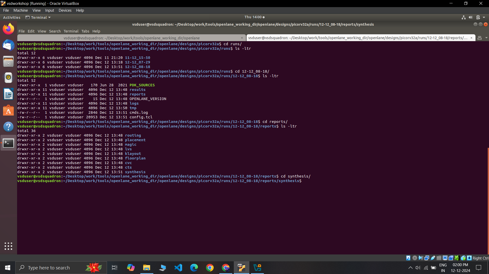

# SoC Design and Planning

## Day 1: Synthesis for PicoRV32A Design

<details>
  <summary><strong>Day 1 Theory</strong></summary>

### Introduction
This project demonstrates the process of designing an ASIC using the **OpenLane** flow, focusing on the synthesis of the **PicoRV32A** design and the calculation of the **Flop Ratio**. The flow follows the **RTL-to-GDSII** process, utilizing open-source tools and libraries to complete the design and verification.

---

### QFN-48 Package

A **QFN-48 (Quad Flat No-Lead)** package is a surface-mount integrated circuit package with 48 leads or pads. It is compact and thermally efficient, ideal for high-performance applications requiring a small form factor.

---

### Package, Pads, Die, Core, and Chip

- **Package**: The physical housing of an integrated circuit, protecting the chip and providing connectivity to external circuits.
- **Pads**: Metal terminals on the die's edges used for electrical connections to the package or external circuit.
- **Die**: The silicon wafer piece containing the integrated circuit (IC).
- **Core**: The central functional part of the die, such as the CPU or processing unit.
- **Chip**: The complete semiconductor device, including the die and the package.

### Relation:
The **package** houses the **die**, which contains the **core**. The **pads** on the edges of the die enable electrical connections between the die and the package or external circuit.

---

### Foundry IPs and Macros

**Foundry IPs** are pre-designed blocks provided by semiconductor foundries:
- **PLL**: Phase-Locked Loop for clock generation and synchronization.
- **ADC**: Analog-to-Digital Converter for signal conversion.
- **SRAM**: Static Random-Access Memory for fast, volatile storage.
- **DAC**: Digital-to-Analog Converter for signal conversion.

**Macros** are high-level, pre-designed components used in chip design:
- **RISC-V SoC**: A system-on-chip based on the RISC-V instruction set architecture.
- **SPT**: Single Processing Thread, referring to specialized processing architectures.

---

### RISC-V ISA

**RISC-V** is an open-standard Instruction Set Architecture (ISA) based on the principles of reduced instruction set computing. It’s designed to be simple, extensible, and open, providing an excellent foundation for building custom processors and microcontrollers.

---

### ASIC Design Flow: RTL to GDSII


1. **Synthesis**:  
   - Converts RTL (written in HDL) into a circuit using components from the standard cell library.  
   - **Standard Cells**:  
     - Have a regular layout.  
     - Each cell comes with different models/views:  
       - **Functional Model**: Describes cell behavior.  
       - **Timing Model**: Captures timing constraints and delays.  
       - **Power Model**: Details power consumption.  
       - **Physical Layout**: Describes the geometrical arrangement for placement and routing.

2. **Floor/Power Planning**:  
   - **Chip Floor Planning**: Divides the chip die among different system building blocks.  
   - **Macro Floor Planning**: Specifies dimensions, pin locations, row definitions, and routing tracks.  
   - **Power Planning**: Constructs a power network to deliver power effectively across the design.

3. **Placement**:  
   - Places standard cells on the floor plan rows aligned with wiring.  
   - Includes:  
     - **Global Placement**: Finds optimal positions for all cells, allowing overlaps and potential illegal placements.  
     - **Detailed Placement**: Adjusts the global placement minimally to ensure legality (e.g., no overlaps).  

4. **Clock Tree Synthesis (CTS)**:  
   - Distributes the clock signal to all sequential elements with minimal skew and in a balanced shape.  
   - Common structures include **H-tree** and **X-tree** architectures.

5. **Routing**:  
   - Implements interconnects using available metal layers to connect cells.  
   - **SkyWater 130nm PDK Example**:  
     - Defines 6 routing layers, the lowest is made of **titanium**, and the rest are **aluminum**.  
     - Metal tracks form a large routing grid; the **divide-and-conquer** approach is used to manage complexity.

6. **Sign-Off**:  
   - Ensures the design is fabrication-ready and meets specifications.  
   - Includes:  
     - **Physical Verification**: Checks physical integrity and correctness.  
     - **DRC (Design Rule Checks)**: Verifies compliance with process design rules.  
     - **LVS (Layout vs. Schematic Check)**: Ensures the physical layout matches the schematic.  
     - **Static Timing Verification**: Confirms timing constraints are met.


### ASIC Design Flow: RTL to GDSII


</details>

---

<details>
  <summary><strong>Day 1 Labs</strong></summary>

### Task: Synthesis for PicoRV32A Design
- Perform synthesis for the **PicoRV32A** design.  
- From the synthesis output, calculate the **Flop Ratio**, which is defined as:  

    Flop Ratio = `(Number of D Flip-Flops) / (Total Number of Cells)`


---

### Lab Process Steps

1. **Initial State of Terminal**  

   In this image, we see the initial state of the terminal where we will access the **OpenLane** directory and begin the process.

2. **Entering the OpenLane Directory** 
 
   Here, we have navigated to the **OpenLane** directory, where we will start working with the design flow.

3. **Invoking OpenLane Flow with Docker**  

   At this step, we invoke the **OpenLane** flow using the **Docker** command to set up the required environment for synthesis.

4. **Dealing with the `flow.tcl` File in Interactive Mode**  

   Inside the OpenLane flow, we work with the **flow.tcl** file to process the design in **interactive mode**. Here, we also bring in the necessary packages to ensure proper functionality.

5. **Preparing the Initial Design from PicoRV32A Directory**  

   In this image, we prep the initial design by navigating to the **PicoRV32A** design directory, where we will work on synthesis.

6. **Preparation Complete, Running `run_synthesis` Command** 
 
   Here, the preparation is complete, and we run the **`run_synthesis`** command to initiate the synthesis step.

7. **Synthesis Complete, Analyzing Results**  
 
   The synthesis step has completed, and we are now ready to examine the results, including calculating the **flop ratio**.

8. **Total Number of Cells** 
  
   The total number of cells in the design is **14,876**.

9. **Total Number of D Flip-Flops**  
 
   The total number of D Flip-Flops in the design is **1,613**.

10. **Viewing Flop Ratio Statistics**  
 
 
 

11.  **Flop Ratio Calculation**  
    Now, we calculate the **flop ratio** using the formula:  
    ```
    Flop Ratio = (Number of D Flip-Flops) / (Total Number of Cells)  
    ```
    
    Substituting the values:  Flop Ratio = `1613 / 14876 ≈ 0.1088`

    Percentage of D Flip-Flops = `0.1088 × 100 = 10.88%`
---
</details>

## Day 2: Floorplanning, Placement, and Library Cells

<details>
  <summary><strong>Day 2 Theory</strong></summary>

### Floorplanning

**Floorplanning** is the step in the physical design process where the layout of the chip is determined, including the dimensions, placement of macros, standard cells, and power planning. It sets the foundation for efficient placement and routing.

#### Steps of Floorplanning

1. **Define Width and Height of Core and Die:**
   - Establish the dimensions of the core and die to accommodate all components.

2. **Define Locations of Pre-Placed Cells:**
   - Place large macros and cells that are fixed due to design constraints.

3. **Use of Decoupling Capacitors:**
   - Place decap cells to manage voltage fluctuations.

4. **Power Planning:**
   - Create a grid of **VDD** and **VSS** lines to ensure proper power delivery.

5. **Pin Placement:**
   - Position input/output pins for efficient routing.

6. **Logical Cell Placement Blockage:**
   - Define areas where standard cells should not be placed to avoid congestion.

---

### Placement and Routing

**Placement** involves assigning precise physical locations to standard cells within the core area, while **routing** connects these cells using metal layers. The placement process ensures optimal performance and minimal congestion.

#### Steps of Placement and Routing

1. **Bind Netlist with Physical Cells:**
   - Map logical design components to physical cells in the library.

2. **Placement:**
   - Perform global and detailed placement to ensure optimal positions.

3. **Optimized Placement:**
   - Refine cell locations to enhance performance and reduce routing complexity.

---

### Standard Cells, Cell Design Flow, and Need for Characterization

During each step of physical design, standard cells like gates, buffers, inverters, and flip-flops are commonly used. A collection of these cells forms the **library**, which is essential for EDA tools to interpret and implement the design. Libraries include cells of varying sizes, functionalities, and threshold voltages.

#### Cell Design Flow

Each standard cell is created using a defined process:

1. **Input:**
   - **PDKs:** Process Design Kits containing DRC and LVS rules, SPICE models.
   - **Library Specifications:** User-defined constraints and functionality.

2. **Design Steps:**
   - **Circuit Design:** Define the electrical behavior.
   - **Layout Design:** Create the physical representation.
   - **Characterization:** Evaluate timing, noise, and power.

3. **Output:**
   - **Circuit Description Language (CDL):** Output of circuit design.
   - **GDSII, LEF, Extracted SPICE Netlist:** Outputs of layout design.
   - **Timing, Noise, Power .LIBs:** Outputs of characterization.

#### Characterization Flow

Characterization evaluates the performance of cells in terms of **timing**, **power**, and **noise**. This step often uses tools like **GUNA** to generate accurate metrics for library cells.

</details>

---

<details>
  <summary><strong>Day 2 Labs</strong></summary>

### Task

1. Running floorplanning step for **PicoRV32A**.
2. Accessing the die size and calculating its area.
3. Using Magic tool to view and explore the floorplan.
4. Running placement step for **PicoRV32A**.
5. Using Magic tool to view and explore the placement.

---

### Lab Process Steps

1. **Run the `run_floorplan` Command**
   - This step is performed after running the `run_synthesis` command (refer to Day 1 Lab).

   
   
   

2. **Access the `picorv32a.floorplan.def` File**
   - Navigate to the relevant directory as shown below.

   

3. **Calculate Die Area**
    
   - Inside the `.def` file, note the die dimensions:
     - **Die Width = 660685 units**
     - **Die Height = 671405 units**

   - Using the formula:
     
     ```
     Die Area (in unit square) = `Die Width * Die Height
     ```
     
     Convert to microns:
    ```  
    Die Area (in microns square) = Die Area (in unit square)/10^6
    ```  

   - Die Area = `443587.21 micron²`

4. **Use Magic Tool for Floorplan Visualization**
   - Command to open Magic for graphical exploration.

   

5. **Floorplan Results**
   - **Floorplan DEF in Magic:**
     
   - **Port Layers:**
     
     
   - **Equidistant Ports:**
     
   - **Decap Cells and Tap Cells:**
     
   - **Unplaced Standard Cells:**
     

6. **Run the `run_placement` Command**
   - Command to perform placement step.

   
   
   

7. **Use Magic Tool for Placement Visualization**
   - Open Magic to view placement results graphically.

   

8. **Placement Results**
   - **Placement Results in Magic:**
     
     

</details>

## Day 3: Design Library Cells Using Magic Layout and NGSpice Characterization

<details>
  <summary><strong>Day 3 Theory</strong></summary>

### Standard CMOS Inverter

In this section, we learn about the **standard CMOS inverter** and its SPICE deck to acquire its **Vout vs Vin** characteristics. The basic CMOS inverter consists of a PMOS transistor connected to a VDD supply and an NMOS transistor connected to VSS. The input signal is applied to the gate of both transistors, and the output is taken from the connection between the PMOS and NMOS. The key characteristics of a CMOS inverter are its low power consumption, high noise margins, and ability to drive large currents.  

When analyzing the inverter in SPICE, we can observe its output voltage (Vout) as a function of the input voltage (Vin). The transition from low to high output voltage corresponds to the switching behavior of the inverter.

**Practical Implementation:**  
For our implementation, we select the **W/L ratio of the PMOS transistor** to be slightly greater than that of the NMOS transistor. This ensures proper voltage levels at the output.

### Static and Dynamic Characterization of CMOS

- **Static Characterization:**  
  Key parameters such as **input high voltage (Vih)**, **input low voltage (Vil)**, **output high voltage (Voh)**, **output low voltage (Vol)**, **switching threshold voltage (Vth)**, and **noise margins** help in static characterization.

- **Dynamic Characterization:**  
  Parameters such as **propagation delay**, **rise time**, and **fall time** are used to evaluate dynamic behavior.

### 16-Mask CMOS Fabrication Process

The steps in the **16-mask CMOS fabrication process** are as follows:

1. **Selecting a substrate:** We select a **p-Si** substrate.
2. **Creating active regions for transistors.**
3. **Formation of N-well and P-well.**
4. **Formation of the gate.**
5. **Formation of lightly doped drain (LDD):** This helps avoid hot electron effects and short channel effects.
6. **Source and drain formation.**
7. **Formation of contacts and local interconnects.**
8. **Higher-level metal formation.**  
   

### Use of LEF Files in VLSI Industry

**LEF (Library Exchange Format)** files are widely used in the VLSI industry to describe the physical layout of standard cells, including their geometries, pin locations, and other properties. LEF files provide a crucial interface between the design and manufacturing processes.

</details>

---

<details>
  <summary><strong>Day 3 Labs</strong></summary>

### Task: SPICE Characterization and Magic Layout Tool for CMOS Inverter
In this task, you will:
1. Use **NGSpice** to simulate the CMOS inverter's behavior, including **Vout vs Vin**.
2. Use the **Magic Layout Tool** to view and analyze the layout of the CMOS inverter.

--- 

### Lab Process Steps

1. Clone the git repository from the provided URL:
   ```bash
   git clone https://github.com/nickson-jose/vsdstdcelldesign

  

2. Copy `sky130A.tech` file:
   from ~/Desktop/work/tools/openlane_working_dir/pdks/sky130A/libs.tech/magic/ to
~/Desktop/work/tools/openlane_working_dir/openlane/vsdstdcelldesign/

  

3. Open the inverter design in Magic using the following command:  
magic -T sky130A.tech inverter.mag &
  

4. Explore the inverter design as follows:  
- Upper region is PMOS.  
- Lower region is NMOS.  
- Y is the output.  
- A is the input.  
- VSS connectivity is with VGND.  
- VDD connectivity is with VPWR.  

  
  
  
  
  
  

---

## Task 2: Perform SPICE Extraction of the Inverter  

1. Extract the inverter cell in Magic.  
  
  

2. Check if the `.spice` file is created at the required location.  
  

---

## Task 3: Modify SPICE Deck and Perform Post-Layout Simulations  

1. Open the `.spice` file, explore it, change the model parameters and values as shown in the last image. Also note that the minimum cell dimension is `0.010u` so change it also      

  
resultant final spice deck(.spice) file is :


2. Run NGSpice simulation and plot y (output) vs time along with input a.


4. Calculate the following values:  

- **Rise Transition Time**:  
  ```
  Rise Transition Time = Time taken by output to reach 80% of its peak value - Time taken by output to reach 20% of its peak value
  ```  
  20% = `0.66 V`, 80% = `2.64 V`

  20 %
  
  80 %
  

  coordinates
  

  Rise Transition Time = `(2.246 - 2.182) ns = 0.046 ns`  

- **Fall Transition Time**:  
  ```
  Fall Transition Time = Time taken by output to fall to 20% of its peak value - Time taken by output to fall to 80% of its peak value
  ```  
  80 %
  
  20 %
  

  coordinates
  
  Fall Transition Time = `(4.095 - 4.052) ns = 0.043 ns`  

- **Rise Cell Delay**:  
  ```
  Rise Cell Delay = Time taken by output to reach 50% of its peak value - Time taken by input to fall to 50% of its peak value
  ```  
  50% = `1.65 V`  
  
  
  Rise Cell Delay = `(2.211 - 2.150) ns = 0.061 ns`  

- **Fall Cell Delay**:  
  ```
  Fall Cell Delay = Time taken by output to fall to 50% of its peak value - Time taken by input to reach 50% of its peak value
  ```  
  
   
  Fall Cell Delay = `(4.077 - 4.049) ns = 0.028 ns`  

---

## Task 4: Fix DRC Rule Violations  

1. Download the lab files, change the directory, and open the Magic tool for graphical exploration.

 

Open the `.magicrc` file in vim.


Empty Magic layout along with terminal:
 

2. Go to: [SkyWater PDK Rules](https://www.skywater-pdk.readthedocs.io/en/main/rules/periphery.html#poly).  


3. Open `poly.mag` in Magic to check for violations under the `poly.9` DRC rule.  

 

4. Identify the incorrectly implemented designs violating `poly.9` (dimension `< 0.480 um`).
poly.9 drc rule

violated rule in magic which is not considered as drc violation
  

5. Add a new rule for `poly.9` in the `sky130A.tech` file.  


6. Reload the tech file and perform DRC check to validate the fixes.  

7. We can also implement other design to verify poly.9 drc check


### **Fixing the nwell.4 DRC Rule Implementation**  

1. `nwell.4` states:  
 

2. Identify missing violations in Magic.  
 

3. Add a new rule for `nwell.4` in the `sky130A.tech` file.  

 

4. Reload the tech file and rerun DRC checks.  
  

### **Fixing the difftap.2 DRC Rule Implementation**  

1. `difftap.2` states:  


2. Identify missing violations in Magic.  


3. Add a new rule for `difftap.2` in the `sky130A.tech` file.  
  

4. Reload the tech file and rerun DRC checks.  
 

