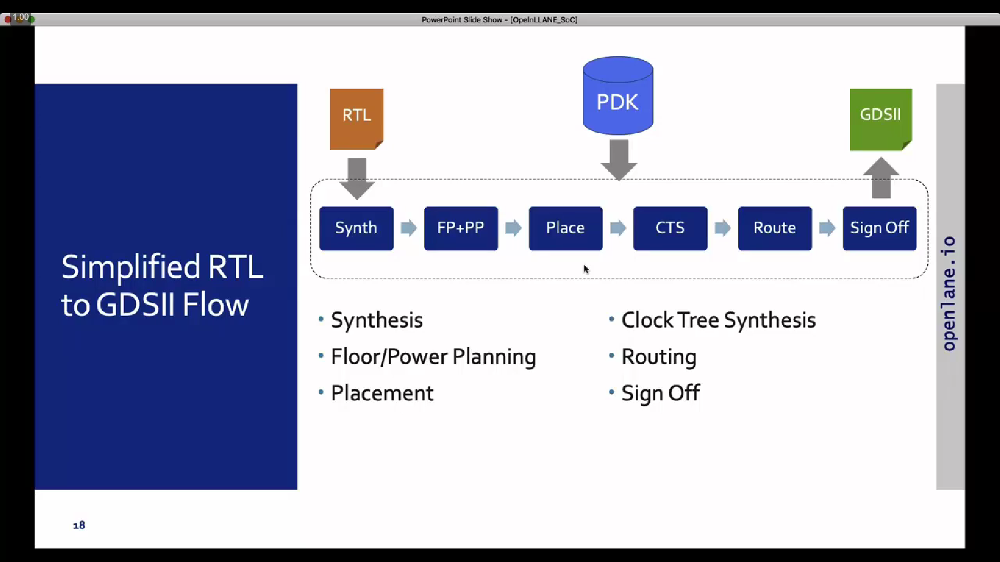

# SoC Design and Planning

## Day 1: Synthesis for PicoRV32A Design

  
<strong>Day 1 Theory</strong>

### Introduction
This project demonstrates the process of designing an ASIC using the **OpenLane** flow, focusing on the synthesis of the **PicoRV32A** design and the calculation of the **Flop Ratio**. The flow follows the **RTL-to-GDSII** process, utilizing open-source tools and libraries to complete the design and verification.

---

### QFN-48 Package

A **QFN-48 (Quad Flat No-Lead)** package is a surface-mount integrated circuit package with 48 leads or pads. It is compact and thermally efficient, ideal for high-performance applications requiring a small form factor.

---

### Package, Pads, Die, Core, and Chip

- **Package**: The physical housing of an integrated circuit, protecting the chip and providing connectivity to external circuits.
- **Pads**: Metal terminals on the die's edges used for electrical connections to the package or external circuit.
- **Die**: The silicon wafer piece containing the integrated circuit (IC).
- **Core**: The central functional part of the die, such as the CPU or processing unit.
- **Chip**: The complete semiconductor device, including the die and the package.

### Relation:
The **package** houses the **die**, which contains the **core**. The **pads** on the edges of the die enable electrical connections between the die and the package or external circuit.

---

### Foundry IPs and Macros

**Foundry IPs** are pre-designed blocks provided by semiconductor foundries:
- **PLL**: Phase-Locked Loop for clock generation and synchronization.
- **ADC**: Analog-to-Digital Converter for signal conversion.
- **SRAM**: Static Random-Access Memory for fast, volatile storage.
- **DAC**: Digital-to-Analog Converter for signal conversion.

**Macros** are high-level, pre-designed components used in chip design:
- **RISC-V SoC**: A system-on-chip based on the RISC-V instruction set architecture.
- **SPT**: Single Processing Thread, referring to specialized processing architectures.

---

### RISC-V ISA

**RISC-V** is an open-standard Instruction Set Architecture (ISA) based on the principles of reduced instruction set computing. It’s designed to be simple, extensible, and open, providing an excellent foundation for building custom processors and microcontrollers.

---

### ASIC Design Flow: RTL to GDSII

1. **Synthesis**:  
   - Converts RTL (written in HDL) into a circuit using components from the standard cell library.  
   - **Standard Cells**:  
     - Have a regular layout.  
     - Each cell comes with different models/views:  
       - **Functional Model**: Describes cell behavior.  
       - **Timing Model**: Captures timing constraints and delays.  
       - **Power Model**: Details power consumption.  
       - **Physical Layout**: Describes the geometrical arrangement for placement and routing.

2. **Floor/Power Planning**:  
   - **Chip Floor Planning**: Divides the chip die among different system building blocks.  
   - **Macro Floor Planning**: Specifies dimensions, pin locations, row definitions, and routing tracks.  
   - **Power Planning**: Constructs a power network to deliver power effectively across the design.

3. **Placement**:  
   - Places standard cells on the floor plan rows aligned with wiring.  
   - Includes:  
     - **Global Placement**: Finds optimal positions for all cells, allowing overlaps and potential illegal placements.  
     - **Detailed Placement**: Adjusts the global placement minimally to ensure legality (e.g., no overlaps).  

4. **Clock Tree Synthesis (CTS)**:  
   - Distributes the clock signal to all sequential elements with minimal skew and in a balanced shape.  
   - Common structures include **H-tree** and **X-tree** architectures.

5. **Routing**:  
   - Implements interconnects using available metal layers to connect cells.  
   - **SkyWater 130nm PDK Example**:  
     - Defines 6 routing layers, the lowest is made of **titanium**, and the rest are **aluminum**.  
     - Metal tracks form a large routing grid; the **divide-and-conquer** approach is used to manage complexity.

6. **Sign-Off**:  
   - Ensures the design is fabrication-ready and meets specifications.  
   - Includes:  
     - **Physical Verification**: Checks physical integrity and correctness.  
     - **DRC (Design Rule Checks)**: Verifies compliance with process design rules.  
     - **LVS (Layout vs. Schematic Check)**: Ensures the physical layout matches the schematic.  
     - **Static Timing Verification**: Confirms timing constraints are met.

### ASIC Design Flow: RTL to GDSII

---

  
<strong>Day 1 Labs</strong>

### Task: Synthesis for PicoRV32A Design
- Perform synthesis for the **PicoRV32A** design.  
- From the synthesis output, calculate the **Flop Ratio**, which is defined as:  

**Flop Ratio** = (Number of D Flip-Flops) / (Total Number of Cells)

---

### Lab Process Steps

1. **Initial State of Terminal**  

   In this image, we see the initial state of the terminal where we will access the **OpenLane** directory and begin the process.

2. **Entering the OpenLane Directory** 
 
   Here, we have navigated to the **OpenLane** directory, where we will start working with the design flow.

3. **Invoking OpenLane Flow with Docker**  

   At this step, we invoke the **OpenLane** flow using the **Docker** command to set up the required environment for synthesis.

4. **Dealing with the `flow.tcl` File in Interactive Mode**  

   Inside the OpenLane flow, we work with the **flow.tcl** file to process the design in **interactive mode**. Here, we also bring in the necessary packages to ensure proper functionality.

5. **Preparing the Initial Design from PicoRV32A Directory**  

   In this image, we prep the initial design by navigating to the **PicoRV32A** design directory, where we will work on synthesis.

6. **Preparation Complete, Running `run_synthesis` Command** 
 
   Here, the preparation is complete, and we run the **`run_synthesis`** command to initiate the synthesis step.

7. **Synthesis Complete, Analyzing Results**  
 
   The synthesis step has completed, and we are now ready to examine the results, including calculating the **flop ratio**.

8. **Total Number of Cells: 14,876** 
  
   The total number of cells in the design is **14,876**.

9. **Total Number of D Flip-Flops: 1,613**  
 
   The total number of D Flip-Flops in the design is **1,613**.

10. **Viewing Flop Ratio Statistics**  
 
 
 

11.  **Flop Ratio Calculation**  
    Now, we calculate the **flop ratio** using the formula:  
    
    **Flop Ratio** = (Number of D Flip-Flops) / (Total Number of Cells) = 1613 / 14876 ≈ 0.1088  

    Next, to find the **percentage of D Flip-Flops**, we multiply the result by 100:  
    **Percentage of D Flip-Flops** ≈ 0.1088 × 100 = 10.88%  

---
